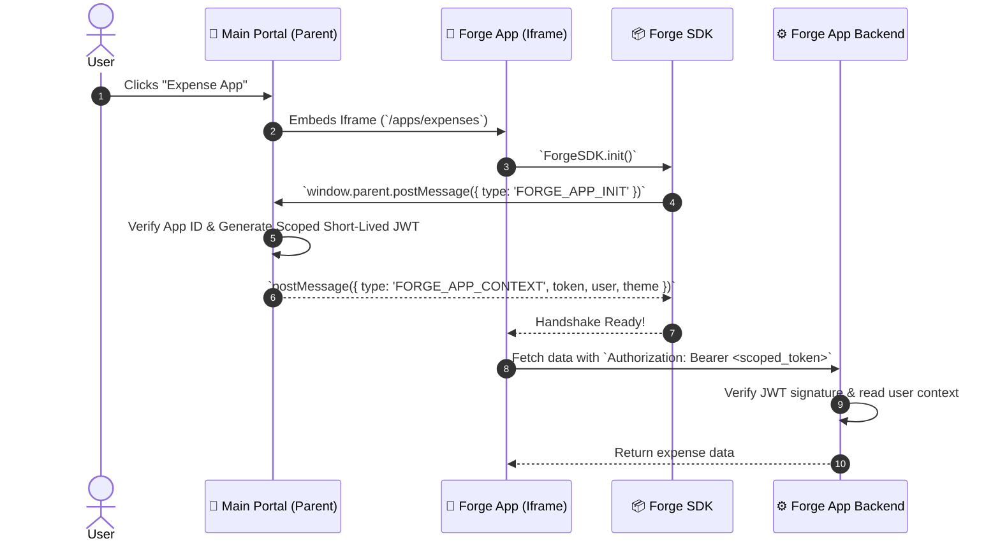
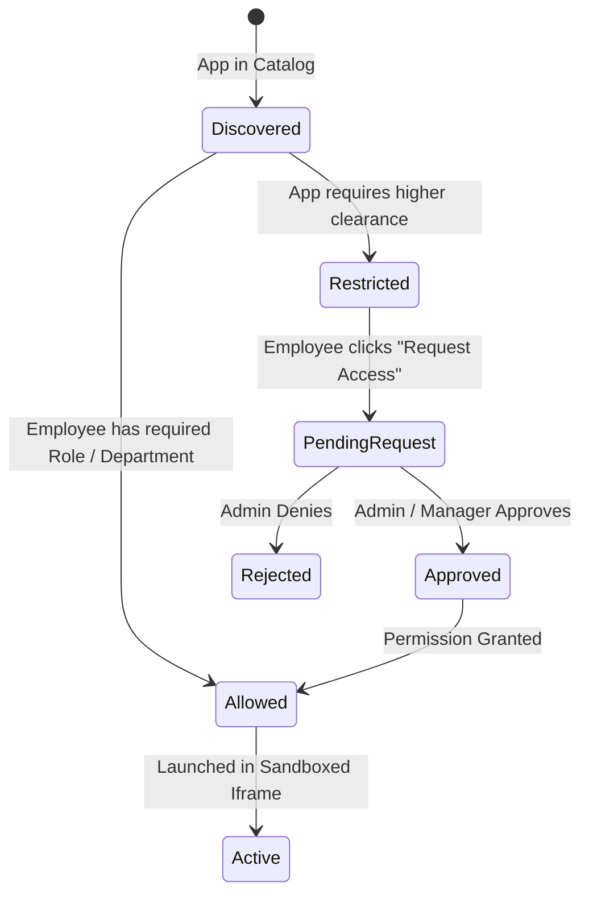

# 02. Forge Apps Specification & Polyglot SDK

## 1. Forge Micro-App Architecture & Anatomy

Each Forge App is a decoupled, self-contained service that can be developed, tested, and deployed independently.


### Standardized Folder Anatomy Inside Every App (`forge-apps/<app-name>/`)

```text
forge-apps/expenses/
├── frontend/                      # 🎨 UI / Web View (built with Astryx UI)
│   ├── src/                       # React / Svelte / Vanilla HTML client
│   └── package.json
│
├── backend/                       # ⚙️ App API Service (Node/Hono, Python/FastAPI, or Go)
│   ├── src/                       # API routes, business logic
│   └── server.ts (or main.py / main.go)
│
├── db/                            # 🗄️ Dedicated Turso (libSQL) Database
│   ├── schema.ts                  # Drizzle ORM schema for this specific app
│   ├── migrations/                # Versioned SQL migration files
│   └── seed.ts                    # Local mock test data
│
├── docker/                        # 🐳 Isolated Containerization
│   ├── Dockerfile                 # Multi-stage lightweight container
│   └── docker-compose.fragment.yml
│
├── scripts/                       # 🛠️ Lifecycle Scripts
│   ├── run.sh                     # Start standalone locally
│   ├── test.sh                    # Run unit/integration tests
│   └── migrate.sh                 # Push Turso schema changes
│
└── portable/                      # 📦 Zero-Host Local Runner config
    └── run-local.sh
```

---

## 2. Dedicated Database per App (Turso / libSQL)

### Why Dedicated Turso DB per App?

1. **Zero Data Leakage / True Multi-Tenancy**:
   - `expenses` cannot read `billing` tables. Even if an app has a SQL injection bug, it is physically partitioned from all other company systems.
2. **Instant Local SQLite with Cloud Edge Replication**:
   - In local development, each app uses a zero-config `.db` file via `libsql`.
   - In staging/production, it connects seamlessly to Turso Cloud replicas with sub-millisecond edge latency.
3. **Independent Schema Migrations**:
   - Upgrading or changing the schema of one app has zero downtime impact on the main portal or any other app.

```typescript
// db/schema.ts (Example for Expenses App using Drizzle + libSQL)
import { sqliteTable, text, integer, real } from 'drizzle-orm/sqlite-core';

export const expenses = sqliteTable('expenses', {
  id: text('id').primaryKey(),
  userId: text('user_id').notNull(),
  title: text('title').notNull(),
  amount: real('amount').notNull(),
  category: text('category').notNull(),
  status: text('status', { enum: ['pending', 'approved', 'rejected'] }).default('pending'),
  receiptUrl: text('receipt_url'),
  createdAt: integer('created_at', { mode: 'timestamp' }).notNull(),
});
```

---

## 3. The Forge SDK Bridge Protocol

The Forge SDK connects the isolated app running in an `iframe` with the parent Main Portal.



### SDK Client-Side Usage (`@forge/sdk`)

```typescript
import { ForgeClient } from '@forge/sdk';

// Initialize handshake
const forge = await ForgeClient.init({
  onThemeChange: (theme) => document.documentElement.setAttribute('data-theme', theme),
});

// Access current employee info
console.log(forge.user.id);       // "usr_123"
console.log(forge.user.name);     // "Jane Doe"
console.log(forge.user.role);     // "manager"
console.log(forge.user.dept);     // "Engineering"

// Authenticated fetch helper
const response = await forge.fetch('/api/expenses');
```

---

## 4. App Access & Request Flow


