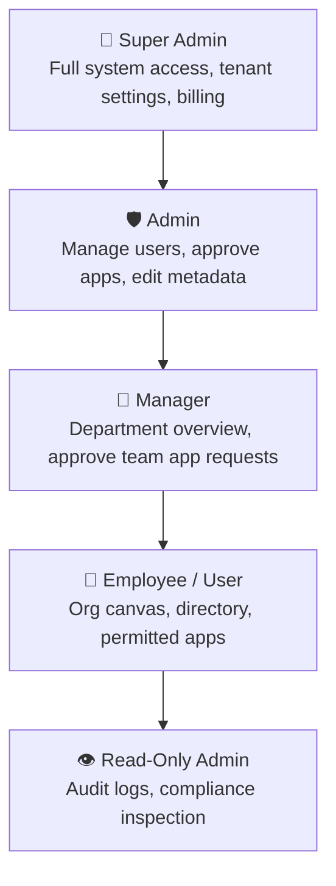

# 03. Security, RBAC & Data Integrity Blueprint

## 1. Zero-Trust Sandboxing Model

To protect the core portal from untrusted or third-party code in Forge Apps, the platform implements a 4-layer security boundary:

```text
┌──────────────────────────────────────────────────────────────────┐
│  Layer 1: Iframe Containment (sandbox="allow-scripts...")        │
├──────────────────────────────────────────────────────────────────┤
│  Layer 2: PostMessage Origin Verification (Strict Whitelist)     │
├──────────────────────────────────────────────────────────────────┤
│  Layer 3: Scoped, Short-Lived JWTs (15-min TTL, App-Bound)      │
├──────────────────────────────────────────────────────────────────┤
│  Layer 4: Dedicated Physical DB Partitioning (Turso SQLite)      │
└──────────────────────────────────────────────────────────────────┘
```

### 1.1 Iframe Security Flags
When embedding Forge Apps in the Main Portal, the iframe uses strict sandbox attributes:
```html
<iframe
  src="/apps/expenses/"
  sandbox="allow-scripts allow-forms allow-same-origin allow-popups"
  referrerpolicy="strict-origin-when-cross-origin"
  loading="lazy"
/>
```
* **Blocked**: Direct access to `window.top.location`, parent cookie manipulation, master session theft.

### 1.2 Scoped JWT Token Issuer
* Apps never receive the employee's master session cookie.
* The Auth Service generates a short-lived (15-minute) JWT bound strictly to `aud: "app:expenses"`.
* If the token is stolen or leaked from one app, it **cannot** be used to access the Main Portal or any other Forge App.

---

## 2. Hierarchical Role-Based Access Control (RBAC)

The platform supports a 5-tier role hierarchy:



### Permission Matrix

| Role | View Org Canvas | Launch Permitted Apps | Request App Access | Ingest CSV Users | Approve App Requests | System Diagnostics |
| :--- | :---: | :---: | :---: | :---: | :---: | :---: |
| **`super_admin`** | ✅ | ✅ | Auto-approved | ✅ | ✅ | ✅ |
| **`admin`** | ✅ | ✅ | Auto-approved | ✅ | ✅ | ✅ |
| **`manager`** | ✅ | ✅ | ✅ | ❌ | ✅ (Team only) | ❌ |
| **`user`** | ✅ | ✅ | ✅ | ❌ | ❌ | ❌ |
| **`read_only_admin`** | ✅ | ❌ | ❌ | ❌ | ❌ | ✅ (View only) |

---

## 3. Data Integrity, Backups & Disaster Recovery

### 3.1 Zero SQL Injection Guarantee
* All database queries (both in Main Portal and Forge Apps) are written strictly with **Drizzle ORM** parameterized queries (`eq()`, `and()`, `inArray()`). Raw SQL string concatenation is blocked by linter rules.

### 3.2 Automated Turso DB Snapshots & Backups
1. **Local Mode**: Automated SQLite `.dump` snapshots are saved to `backups/<app-name>/` before running any migration.
2. **Cloud Mode (Turso)**: Point-in-time recovery (PITR) enabled with automated daily edge snapshots.

```bash
# Snapshot command executed in backup lifecycle
./run.sh backup --app=all
```
