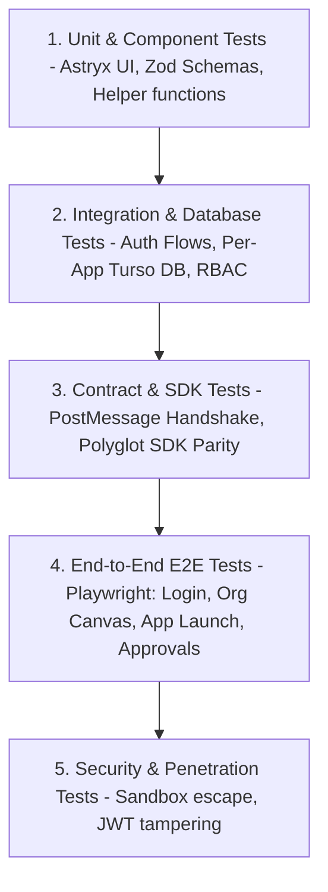

# 04. Testing Strategy & Quality Assurance Pyramid

## 1. The 5-Tier Testing Pyramid



---

## 2. Testing Specifications by Tier

### Tier 1: Unit & Component Testing
* **Scope**: Pure utility functions, Astryx UI components, Zod input validation schemas.
* **Target Speed**: `< 50ms` per test file.
* **Key Tests**:
  * Form validation schemas for user creation and app registration.
  * Astryx UI component state transitions (Idle, Loading, Error, Success).
  * RBAC policy resolution logic (`isAuthorized(user, permission)`).

### Tier 2: Integration & Database Testing
* **Scope**: API route handlers, Server Actions, Drizzle ORM queries against in-memory Turso/libSQL.
* **Key Tests**:
  * User Registration & Login flow generating valid password hashes.
  * Organization tree queries (fetching departments and direct reports).
  * Per-app DB isolation: App A cannot execute queries against App B schema.

### Tier 3: Contract & SDK Bridge Testing
* **Scope**: Communication protocol between Main Portal and Forge Apps.
* **Key Tests**:
  * Simulating `postMessage` handshake between parent and iframe.
  * Ensuring valid tokens are unpacked correctly by the `@forge/sdk` client.
  * Rejecting messages originating from unapproved origins.

### Tier 4: End-to-End (E2E) Browser Journeys (Playwright)
* **Scope**: Complete user workflows executed against a running instance.
* **Key Journeys**:
  1. **Employee Workflow**:
     * Log in $\rightarrow$ View Org Canvas $\rightarrow$ Open App Catalog $\rightarrow$ Launch allowed app.
  2. **App Request Access Workflow**:
     * Employee requests access to restricted app $\rightarrow$ Admin logs in and approves in queue $\rightarrow$ Employee immediately sees app unlocked.
  3. **Developer Workflow**:
     * Open Developer Hub (`:3003`) $\rightarrow$ Test SDK snippet in playground $\rightarrow$ View live container status in Dev Dashboard (`:3002`).

### Tier 5: Security & Zero-Trust Verification
* **Scope**: Automated penetration and boundary validation.
* **Key Tests**:
  * Negative test: Tampering with JWT signature results in `401 Unauthorized`.
  * Negative test: Expired token results in automatic refresh or rejection.
  * Iframe containment test: Ensuring child iframe cannot access `window.parent.localStorage`.

---

## 3. Test Runner CLI Workflow

```bash
./run.sh test unit          # Run fast unit tests
./run.sh test integration   # Run database & API integration tests
./run.sh test contract      # Run SDK & PostMessage contract tests
./run.sh test e2e           # Run Playwright headless browser tests
./run.sh test security      # Run security assertion suite
./run.sh test all           # Run full verification gate
```
