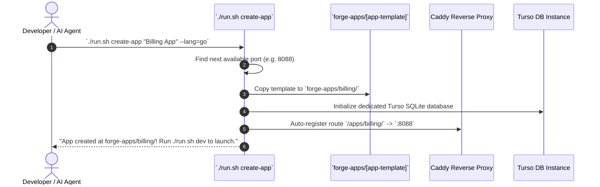

# 05. Developer Experience & AI Maintainability

## 1. The 1-Command Developer Experience

Any developer (or CI/CD runner) can clone the repository and run a single command to get everything up and running with zero host modifications:

```bash
# 🚀 1-Command Complete Setup
./run.sh setup

# 💻 Start Local Development Servers
./run.sh dev

# 🧩 Scaffold a Brand New Micro-App in 5 seconds
./run.sh create-app "Inventory Manager" --lang=ts
```

### CLI Command Reference

| Command | Action |
| :--- | :--- |
| `./run.sh setup` | Checks Docker daemon, configures localized Bun runtimes, initializes Turso databases, and builds SDKs. |
| `./run.sh dev` | Starts reverse proxy (80), portal (3001), dev dashboard (3002), dev hub (3003), and active micro-apps. |
| `./run.sh test` | Runs the 5-tier test suite. |
| `./run.sh doctor` | Performs health diagnostics across ports, Docker containers, and database connections. |
| `./run.sh clean` | Cleans temporary build caches, dangling containers, and test logs. |
| `./run.sh create-app <name>` | Scaffolds a new Forge App with frontend, backend, Turso DB, Dockerfile, and SDK bindings. |

---

## 2. Why This Architecture Is AI-Agent Optimized

### 2.1 Feature Colocation vs Over-Modularization
In traditional layered repos, an AI agent has to edit 7 files in 7 distant folders just to add a single field. In our architecture, all code related to a feature lives together in one cohesive folder:

```text
features/forge-apps/
├── components/          # AppCard.tsx, AppLauncherModal.tsx, RequestAccessDrawer.tsx
├── server/              # apps.service.ts, apps.schema.ts (Drizzle + Zod)
└── hooks/               # useForgeApps.ts
```

* **Result**: An AI agent only loads 1 folder into its context window. Changes are completed in a single turn with zero hallucinated imports.

### 2.2 Standard UI Component Contracts (Astryx UI)
* Because all UI components use standard Meta Astryx components, AI agents do not spend tokens writing custom CSS, modal overlays, or complex layout wrappers.

### 2.3 Explicit Zod & Drizzle Contracts
* Every endpoint and database table has explicit TypeScript and Zod types. When an AI agent needs to know what an object looks like, it checks `schema.ts` and gets 100% type grounding.

---

## 3. Scaffolding a New Forge App (Workflow)


