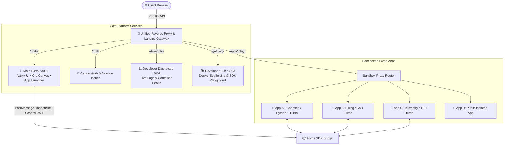

# 🚀 SG Forge - Platform Master Blueprint & Specification

> **Version**: 2.0.0 (Clean Architecture & Multi-Tenant Micro-App Engine)  
> **Status**: Approved System Design & Rebuild Specification  
> **Author**: System Engineering & Architecture Team

---

## 📌 Executive Summary

**SG Forge** is an installable, ready-to-deploy enterprise workspace portal and secure micro-app orchestration engine. It solves corporate portal bloat by unifying:
1. **Interactive Semantic Org Canvas**: A 2D visual, zoomable organizational map replacing static employee directories.
2. **Polyglot Forge Apps Ecosystem**: Independent micro-applications written in any language (TypeScript, Go, Python) running in sandboxed Docker containers with dedicated Turso (libSQL) database instances.
3. **Stateless Central Authentication & Authorization**: Fine-grained hierarchical RBAC with automated "Request Access" approval workflows.
4. **Developer Gateway & Insights Hub**: Built-in developer portal with live container logs, performance telemetry, and SDK playgrounds.
5. **Zero-Host-Install Guarantee**: 100% portable execution locally via standalone binaries (`portables/bun`) or isolated Docker containers (`docker-compose`).

---

## 🏛️ System Topology Infographic

---

## 🧭 Master Documentation Index

| Document | Description |
| :--- | :--- |
| **[01. System Architecture](file:///home/sanket/Desktop/Sanket/org_website_clone/idea/01_ARCHITECTURE.md)** | Network topology, port mapping, reverse proxy routing, and core service boundaries. |
| **[02. Forge Apps Specification](file:///home/sanket/Desktop/Sanket/org_website_clone/idea/02_FORGE_APPS_SPEC.md)** | Micro-app anatomy, per-app Turso (libSQL) DB, polyglot runtimes, and the Forge SDK bridge. |
| **[03. Security & RBAC Blueprint](file:///home/sanket/Desktop/Sanket/org_website_clone/idea/03_SECURITY_AND_RBAC.md)** | Zero-trust iframe containment, scoped JWT tokens, hierarchical access policies, and data backups. |
| **[04. Testing & Verification Strategy](file:///home/sanket/Desktop/Sanket/org_website_clone/idea/04_TESTING_STRATEGY.md)** | 5-Tier testing pyramid, contract testing, E2E browser journeys, and automated CI quality gates. |
| **[05. Developer Experience & AI Maintainability](file:///home/sanket/Desktop/Sanket/org_website_clone/idea/05_DEVELOPER_EXPERIENCE.md)** | 1-command workflow CLI, clean feature colocation, and zero-token-waste AI guidelines. |

---

## ⚡ High-Level Traffic & Interaction Flow

